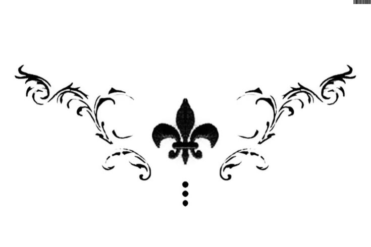
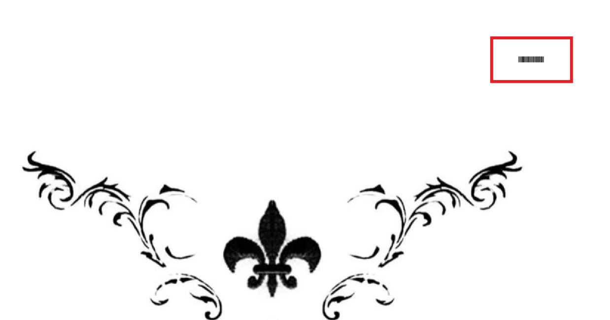
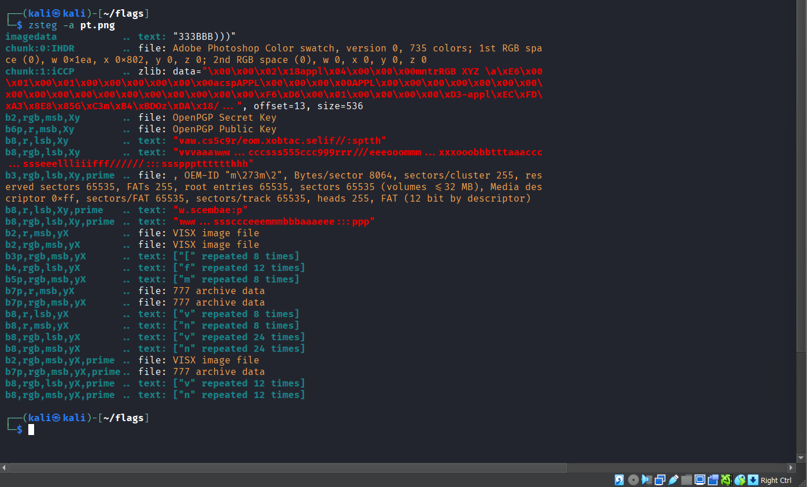
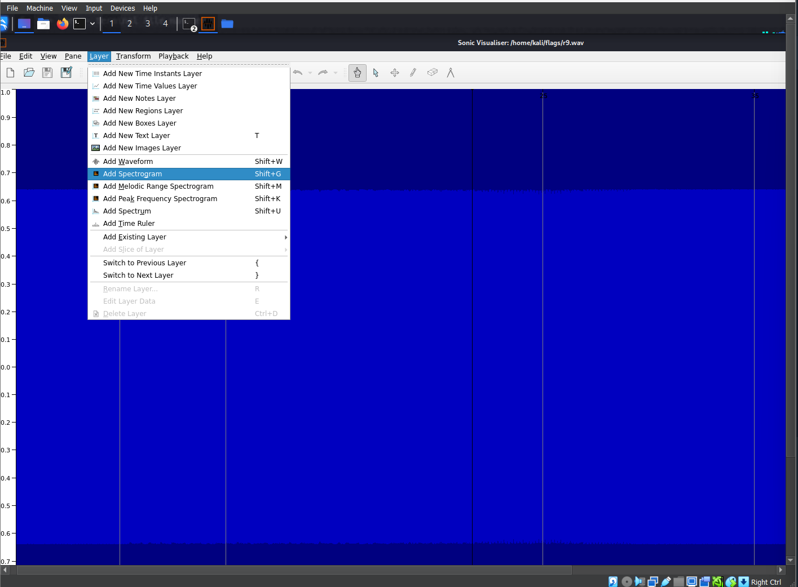
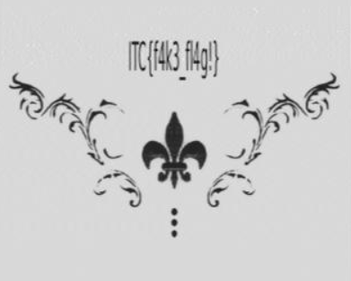
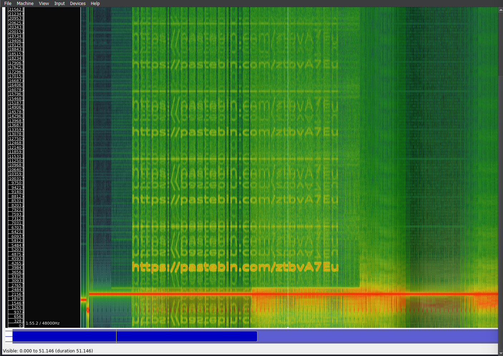
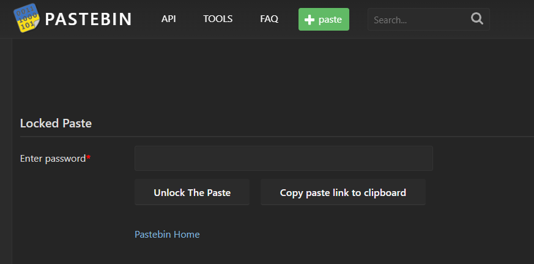
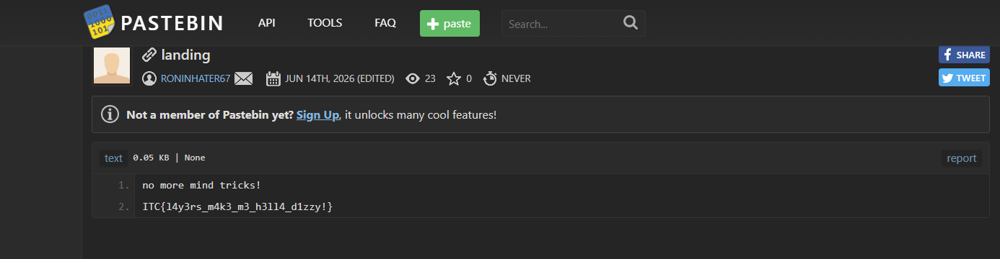

Challenge: "Power Trip"

Event: "Flags CTF"

Category: "Forensics"

Difficulty: "Medium - Hard"

## TL;DR

Multi-layer stego challenge: Black straps hinting to a hiddent audio file →  Hidden audio URL inside a PNG via LSB → Zsteg reveals reversed WAV file → Hearing the audio guide towards SSTV → SSTV reveals a fake flag → spectrogram reveals a Pastebin link → locked paste opens with the fake flag as password → real flag.

## Overview


We are given a PNG image that looks like a simple decorative design. A closer look at the top-right corner reveals faint stripes — a classic hint pointing to a hidden audio file.



## Step 1 — Basic Recon

Whenever I get an image in a CTF, I start with the usual toolkit:

```bash
exiftool 
binwalk 
steghide extract -sf ...
```

Nothing useful came out. Time to go deeper.

## Step 2 — Finding the audio file using zsteg

```bash
zsteg -a pt.png
```


After carefully reading through the output, one line caught my eye: 
  b8,r,lsb,Xy .. text: "vaw.cs5c9r/eom.xobtac.selif//:sptth

That string is a reversed URL. Reversing it gives a `.wav` audio file link.

## Step 3 — Audio Analysis

I opened the WAV file in Audacity first as i usually do — nothing obvious. Then switched to **Sonic Visualiser** you can download it from here : https://www.sonicvisualiser.org/download.html and added a spectrogram layer via **Layer → Add Spectrogram**.



When heard the Audio for the first time, several ideas came to my head (Morse code, ggwave...) but none of them worked, i tried **SSTV** using an SSTV decoding tool and it showed me a fake flag:



I ignored it completely because its a classic Forensics challs troll, but let just not forget about it, we need it in a minute.

Back to the audio file, the spectrogram revealed a Pastebin link embedded in the frequency domain.



## Step 4 — Password-Protected Pastebin

For a sec i thought the flag is there, but the Pastebin is password protected, for 2 hours i tried many methods with both the original pic and audio file but nothing worked..



Wait a minute... Can the fake flag be the Pastebin's Password? The answer is yes, and here is the Flag..



## Flag: ITC{l4y3rs_m4k3_m3_h3ll4_d1zzy!}
