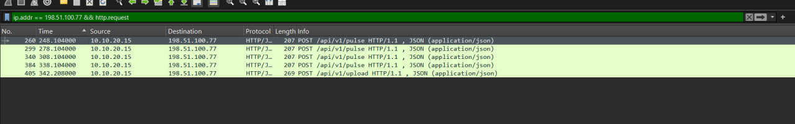
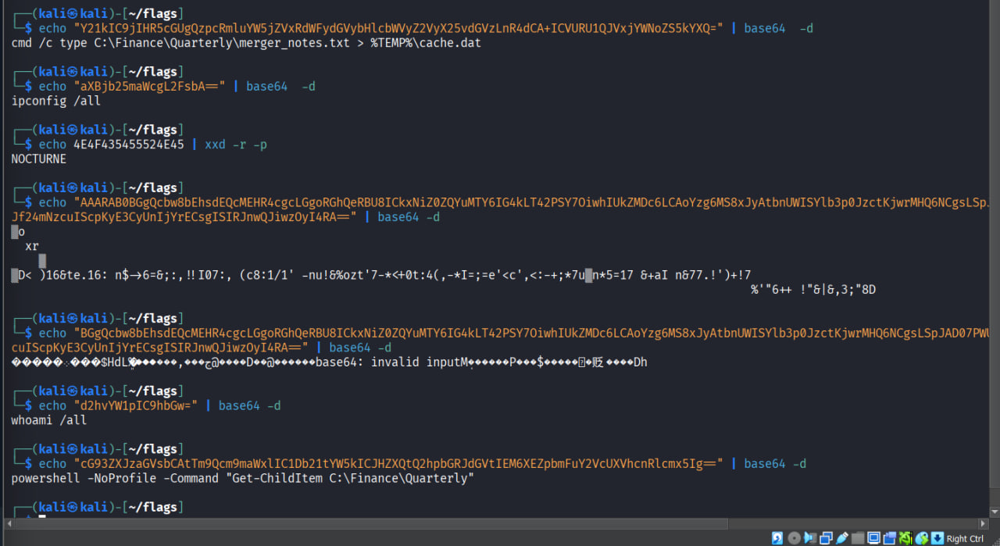
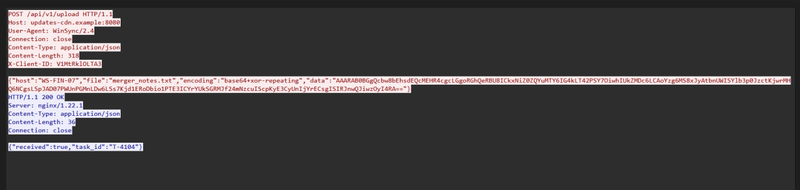
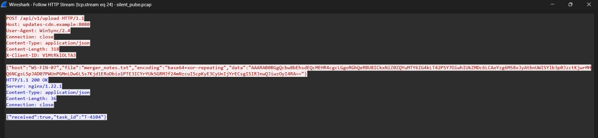
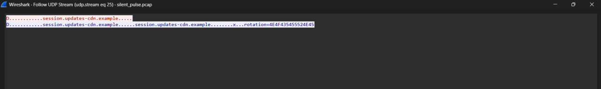
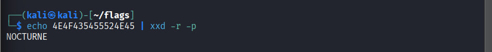

Challenge: "Silent Pulse"
Event: "Flags CTF 2026"
Category: "Network Forensics"
Difficulty: "Medium"

## TL;DR
A finance-VLAN pcap with 452 packets. One workstation stands out from all the background noise, beacons every 30s to a fake "CDN" domain, gets tasked with recon + file-staging commands over HTTP, then exfiltrates a stolen file XOR'ed with a key that's smuggled out through a DNS TXT record.

## Overview
We're handed `silent_pulse.pcap` — ~7 minutes of traffic from a finance VLAN. Mixed in with the usual ARP/ICMP/DNS/mDNS/NTP noise, one host is doing something it shouldn't.

```
Flag format: itc{q1_q2_q3_q4_q5_q6} i processed each question as a step, so the final flag is the concatenation of each step's answer.
```

## Step 1 — Finding the infected host
Whenever I get a pcap, first stop is always **Statistics → Conversations → IPv4**. Sort by packet count and the noisy host jumps right out — everything else is 6-8 packets of background traffic, one IP is clearly talking way more than it should.

```
10.10.20.15
```

Filtered based on it:

```
ip.addr == 10.10.20.15
```

Followed one of the repeated POST streams and the JSON body gives up the hostname and user straight away:

```
{"host":"WS-FIN-07","user":"alice","seq":1,"status":"ready"}
```

**IP:** `10.10.20.15` — **Hostname:** `WS-FIN-07`

## Step 2 — C2 domain and IP
Same HTTP stream from Step 1 has the `Host:` header sitting right at the top:

```
Host: updates-cdn.example:8080
```

and the destination in the packet list confirms the resolved address is always the same one — `198.51.100.77`. Double-checked with:

```
dns.qry.name == "updates-cdn.example"
```

DNS response points to `198.51.100.77`.

**C2 domain:** `updates-cdn.example` — **C2 IP/port:** `198.51.100.77:8080`

## Step 3 — Beacon interval


Filtered the C2 traffic:

```
ip.addr == 198.51.100.77 && http.request
```

Then just did the math on the Time column, subtracting each frame from the one before it:

```
278.104 - 248.104 = 30
308.104 - 278.104 = 30... and so on
```


Every single request lands exactly 30s after the last one — textbook fixed-interval beacon.

**Beacon interval:** `30 seconds`

## Step 4 — Decoding the C2 commands


Same filter, followed each HTTP stream, and the server's replies carry a base64 `command` field. Decoded each one straight in terminal:

```bash
echo "d2hvYW1pIC9hbGw=" | base64 -d
whoami /all

echo "aXBjb25maWcgL2FsbA==" | base64 -d
ipconfig /all

echo "cG93ZXJzaGVsbCAtTm9Qcm9maWxlIC1Db21tYW5kICJHZXQtQ2hpbGRJdGVtIEM6XEZpbmFuY2VcUXVhcnRlcmx5Ig==" | base64 -d
powershell -NoProfile -Command "Get-ChildItem C:\Finance\Quarterly"
```

And a 4th one staging the target file into a temp cache — classic recon → discovery → staging progression before the exfil.

**Commands:**
```
whoami /all
ipconfig /all
powershell -NoProfile -Command "Get-ChildItem C:\Finance\Quarterly"
cmd /c type C:\Finance\Quarterly\merger_notes.txt > %TEMP%\cache.dat
```

## Step 5 — Finding the exfiltrated file



Filtered for the upload leg instead of the pulse beacons:

```
ip.addr == 198.51.100.77 && http.request.method == "POST"
```

One request stood out — `POST /api/v1/upload` instead of `/pulse`. Followed the stream, and the JSON body names the file directly:

```
{"host":"WS-FIN-07","file":"merger_notes.txt","encoding":"base64+xor-repeating","data":"AAARAB0BGgQcbw8bEhsdEQcM..."}
```

**Exfiltrated file:** `merger_notes.txt`

## Step 6 — Decoding the stolen file and grabbing the flag


The `data` field is `base64+xor-repeating` — base64 was easy, but I needed the XOR key. Went digging back through the DNS traffic:

```
dns.qry.name contains "updates-cdn"
```

Found a TXT query for `session.updates-cdn.example` with a suspicious answer:

```
rotation=4E4F435455524E45
```

Decoded the hex:

```bash
echo 4E4F435455524E45 | xxd -r -p
NOCTURNE
```


That's the XOR key. Grabbed the `data` field from the upload POST and ran it through a quick script:

```python
import base64

data_b64 = "AAARAB0BGgQcbw8bEhsdEQcM..."
key = b"NOCTURNE"

raw = base64.b64decode(data_b64)
plaintext = bytes(b ^ key[i % len(key)] for i, b in enumerate(raw))
print(plaintext.decode())
```

Output:

```
NORTHSTAR LOGISTICS - INTERNAL
Project: Harbor acquisition
Meeting location: Dock 9 records office
This is synthetic CTF evidence.
FLAG: itc{silent_pulse_http_c2_exfil}
```

## Flag: `itc{10.10.20.15_WS-FIN-07_updates-cdn.example_198.51.100.77:8080_30s_NOCTURNE_merger_notes.txt_itc{silent_pulse_http_c2_exfil}}`


## Summary of the attack chain
1. `WS-FIN-07` (`10.10.20.15`, user `alice`) grabs a payload disguised as a PDF.
2. Malware beacons every 30s to `updates-cdn.example` (`198.51.100.77:8080`) via `POST /api/v1/pulse`.
3. C2 tasks it with recon (`whoami`, `ipconfig`) → discovery (`Finance\Quarterly`) → staging (`merger_notes.txt` → `cache.dat`).
4. Staged file exfiltrated via `POST /api/v1/upload`, base64 + repeating-key XOR.
5. XOR key (`NOCTURNE`) smuggled out via a DNS TXT record as hex — DNS-based key delivery.
6. Decoding the stolen file reveals the final piece, which gets wrapped with the other five answers to form the full submission flag.
